# Setting up the laser

## Laser illumination

Illuminating the sample can be done with different lasers. In the here
presented setup, the laser illumination is provided by the 638nm Red
Laser Module 500mW Round Dot Focusable TTL 3050 (acquired on
lasernets.com). In order to perform imaging assays needing high laser
intensities, the laser path remains unchanged (see excitation pathway
figure) to maximize the photon density at the sample plane. The optional
beam magnifier combined with a diffuser enables to have a more even and
homogenized illumination across the field of view, which is more
desirable for imaging assays with lower requirements in terms of laser
density.

The construction consists of a telescopic lens arrangement with a
diffusor rotating in the focal point of both lenses. A simplified
version can be built by combining a fan, where the rotor blades have
been removed, with a piece of cling foil as diffusing material.

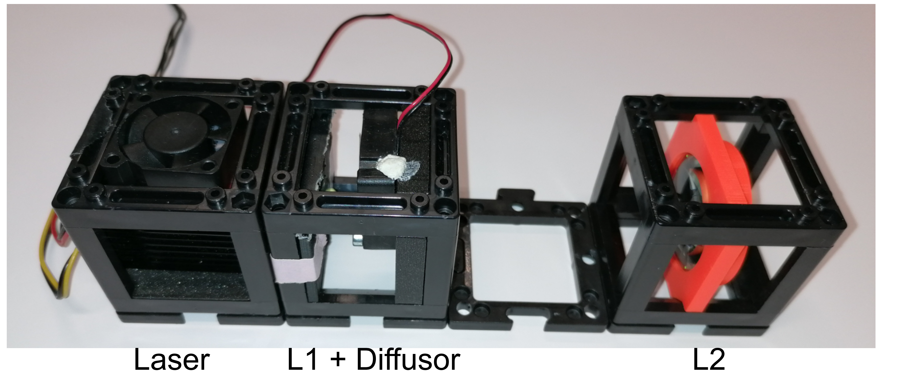
*Fig. 1: telescope build with diffuser (rotating cling foil)*

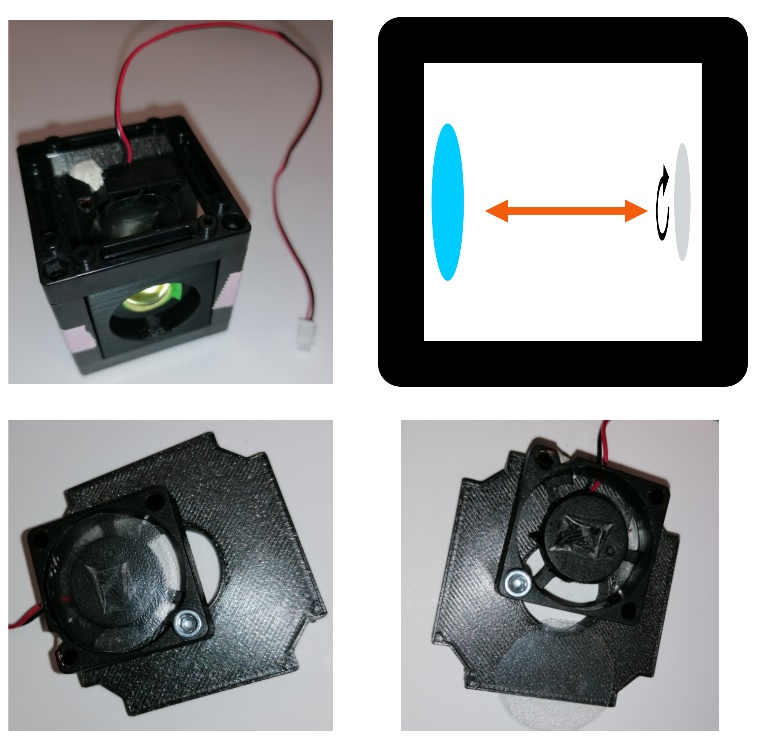
*Fig. 2: Within the cube containing L1 and the diffusor, the distance between
both matches the focal length of L1. For different magnification, they
can also be placed within two different cubes. The diffusor itself is
attached to a regular UC2 cube mount. The position of the fan is not
important, as long as the light path is not blocked. The cling foil is
simply stuck to the fan center with a piece of tape.*

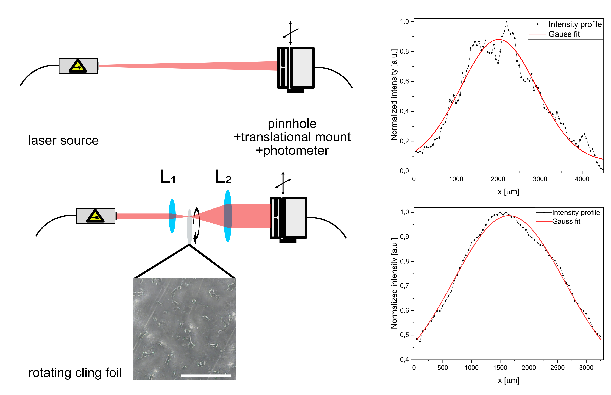

Fig. 3: Difference in laser profile using the diffusor and telescopic
lens. The profile has been measured by shifting a photometer covered by
a pinhole across the laser spot. The distances between the components on
the schematics (left) are not up to scale. The scale bar in the image
showing the cling foil surface represent 1mm.

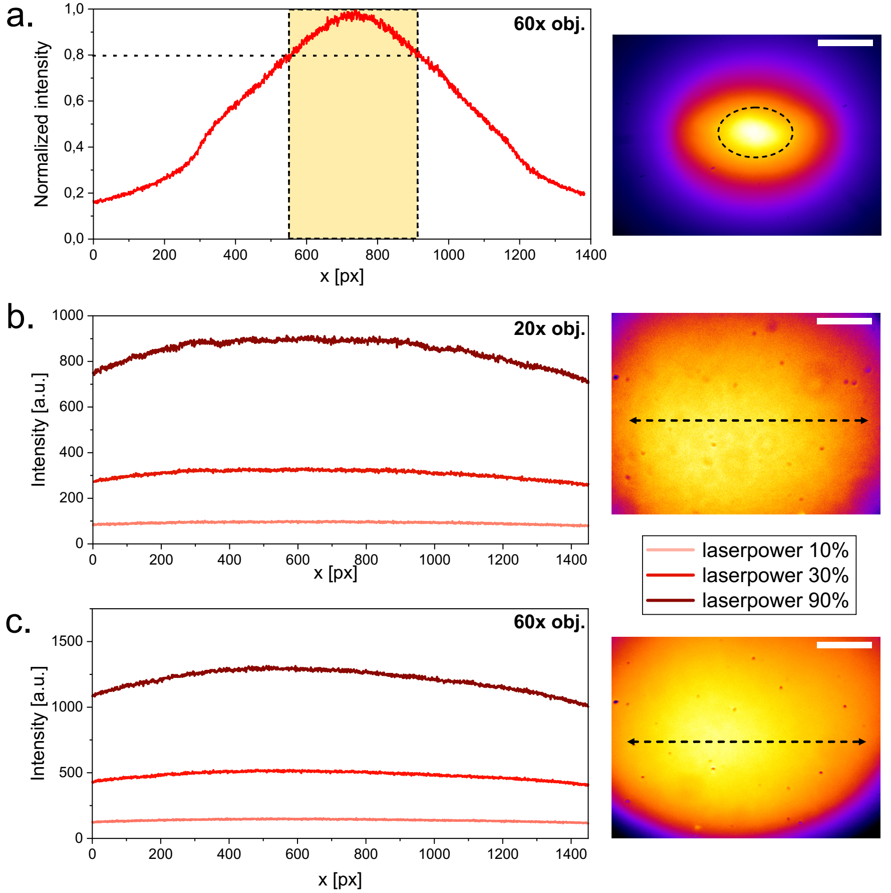

*Fig. 4: Illumination profile as measured on a fluorescent far red Chroma
slide at the sample plane. Illumination of the laser itself using a 60x
objective (a.), of the laser combined with diffusor, telescope and a 20x
objective (b.), of the laser combined with diffusor, telescope and a 60x
objective (c.). The graphs on the left represent the horizontal profile
of the illumination. The images on the right represent the complete
field of view, with scale bars representing 30 µm for the 60x and 90 µm
for the 20x objective.*

## Filtering Illumination

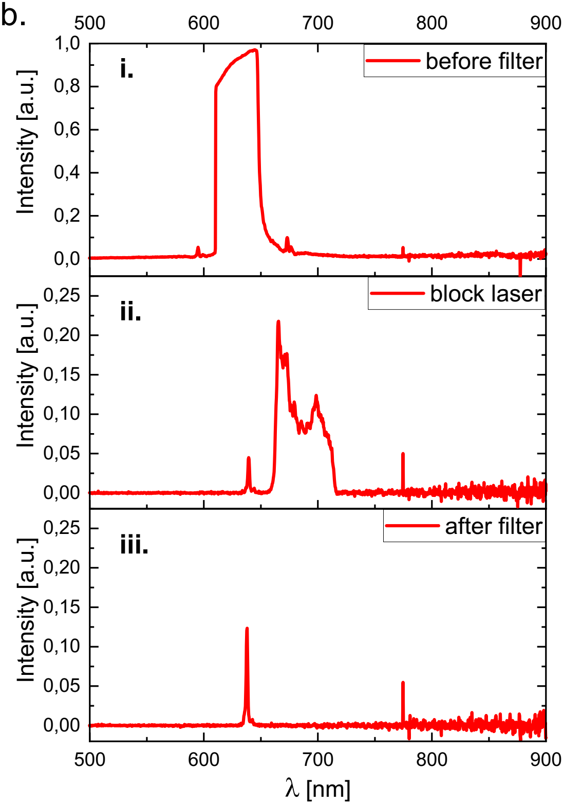

Spectrum of the laser emission measured at the sample plane **i.**
without any filter, **ii.** with a filter only blocking the laser-line,
**iii.** with a combination of emission filter and excitation filter.

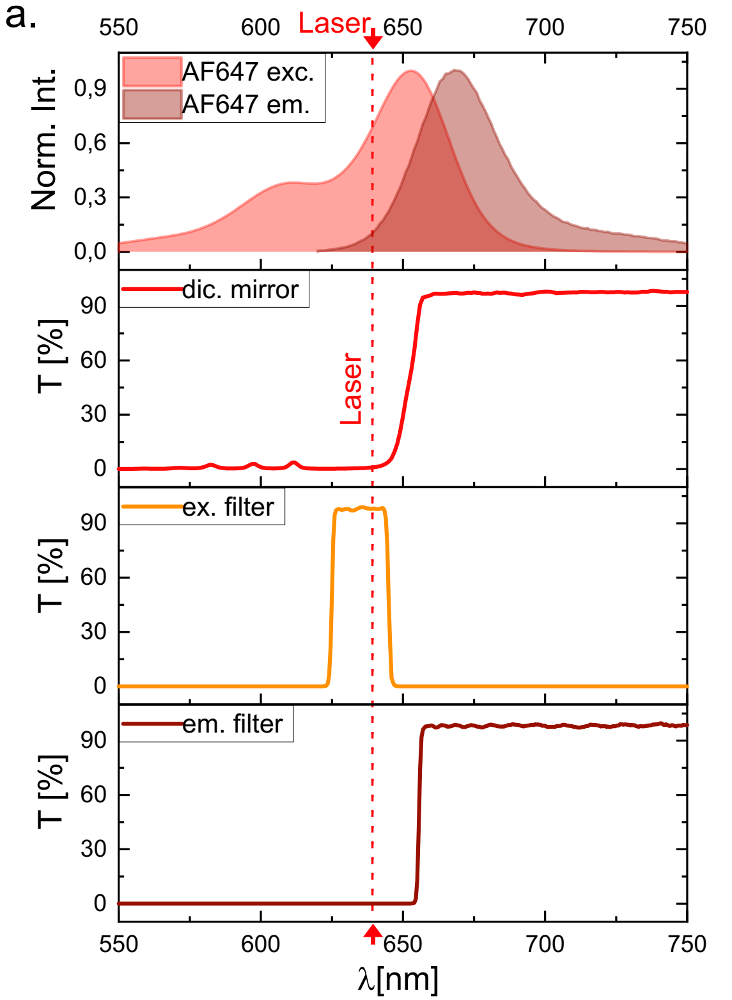

Absorption and emission spectrum of AF647, spectra of the dichroic
mirror (Chroma ZT640rdc), the excitation filter (Chroma ZET635/20x EX),
and the emission filter (for λ &gt; 655 nm, Chroma ET655lp long-pass).

## Illumination with a fiber coupled laser

The usage of a simple laser which can be adapted according to the
experimental needs is a solution which makes the setup adaptable and
allows users to perform different assays without acquiring additional
hardware. For microscopy applications where high laser intensities
applications are not necessary, the use of a fiber coupled laser might
be a practicable alternative for the illumination. Laser beams emanating
from a single mode fiber have a gaussian profile which should be free of
speckles and interferences. The fiber also has advantages in terms of
laser safety and simplicity of usage as it can be combined to various
commercially available cage and tube systems.

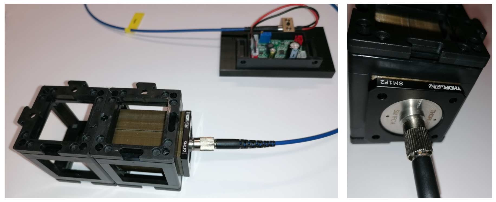

Fig. 5: Fiber illumination module.

. The lens (b) is connected to
the fiber adapter (d) via a tube with mounting threads (c). Length of
the tube is adapted to set the distance between the lens and the fiber
end (e) to the focal length of the lens (b, here 50 mm).

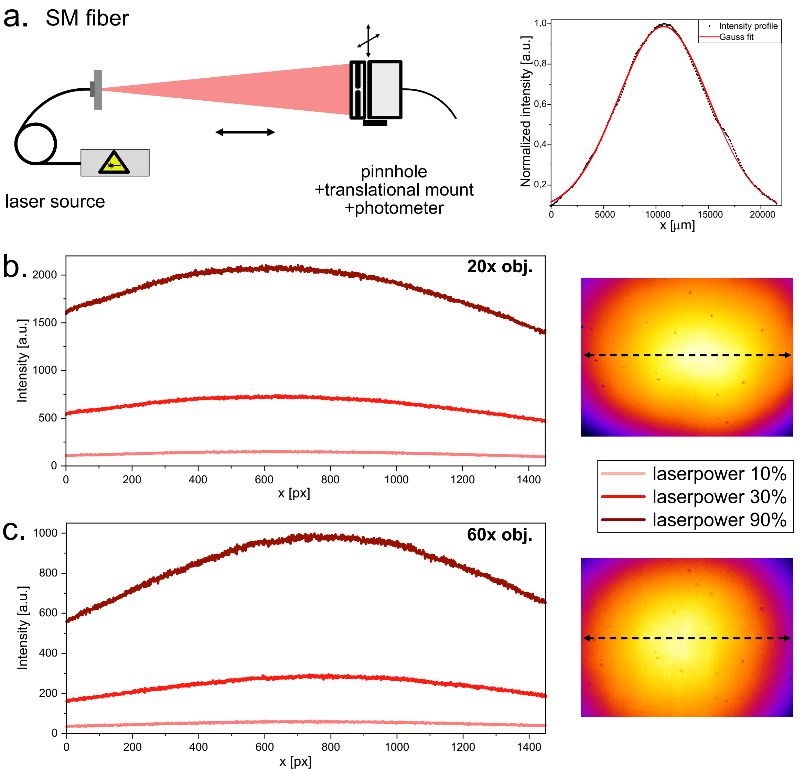

Fig.7: Characterization of the fiber laser illumination. a. Laser
profile measured by shifting a photometer covered by a pinhole across
the laser spot. The illumination is further characterized by imaging a
far-red fluorescent Chroma slide with a 20x and a 60x objective. The
horizontal line profiles (left) represent the dotted line on the images
of the field of view (right).

## Top light illumination

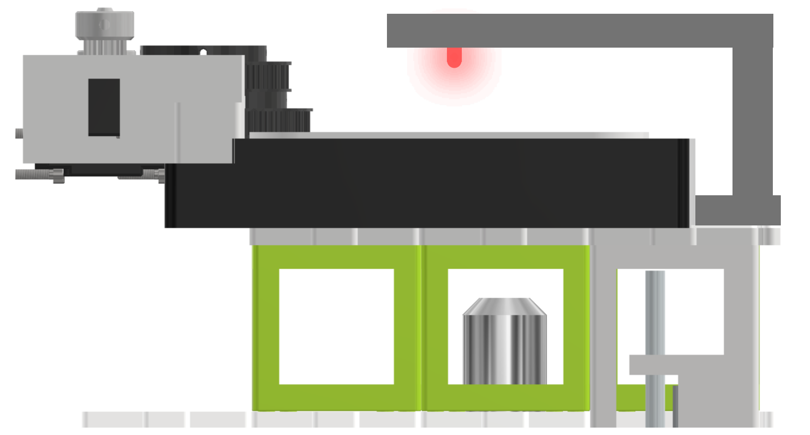

Fig. 8: Top light illumination via a 3D printed arm holding a red (635
nm) LED. Alternatively, a high-power white LED or an LED array can be
used as top-light illumination.

## Imaging with the UC2-STORM setup

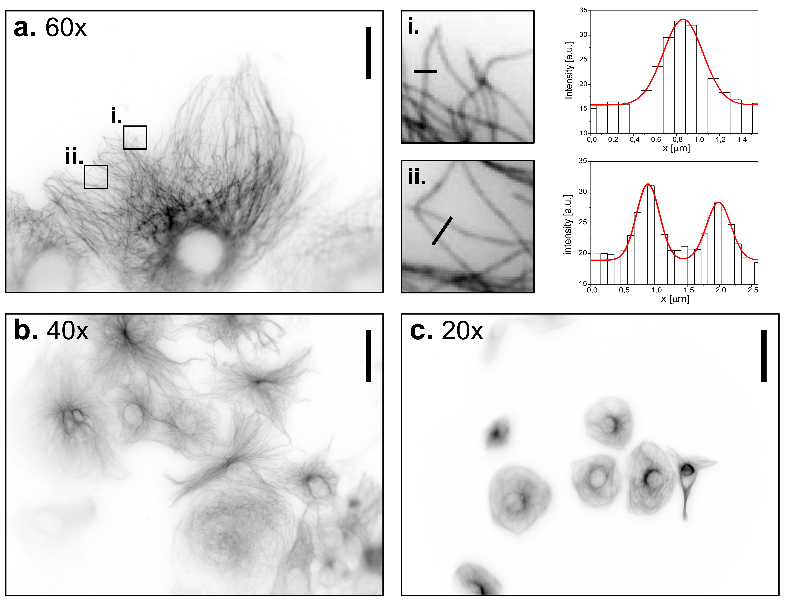

Widefield images of CV-1 cells immune-stained against tubulin, at
different magnifications using the UC2 microscope. **a.** 60x objective,
scale bar represents 30 µm. Two regions of interest have been zoomed in
to demonstrate the ability to detect and characterize single
microtubules. **b.** 40x objective, scale bar represents 45 µm. **c.**
20x objective, scale bar represents 90 µm.

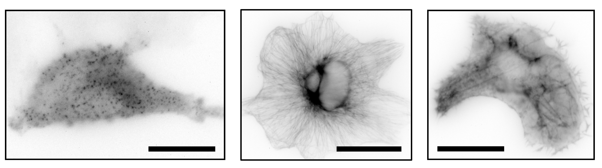

Widefield images of immune-stained clathrin coated pits (left),
immune-stained tubulin (middle) and SiR Actin stain of CV-1 cells with
the UC2 setup and a 60x objective. Scale bar represents 25 µm.

Live cell imaging of CV-1 cells stained with SiR actin over a period of
five hours.

Live cell imaging of T98G cells stained with SYTO far red nucleic dye
over a period of two days within an incubator.

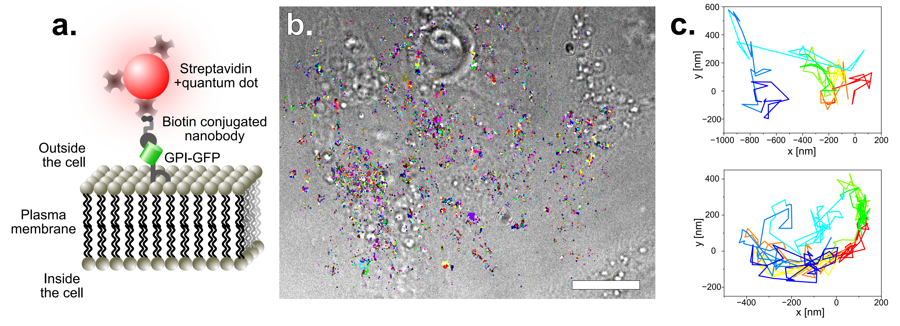

Single particle tracking of GPI-GFP on HeLa cells. For more
photostability, the tracks are acquired by imaging quantum dots. These
have been functionalized with straptavidin and are attached to GFP via
biotin conjugated anti-GFP nanobodies. The construct is schematically
disaplayed in **a.** The acquired tracks are overlayed on a bright-field
image of the HeLa cells (**b.**) (scale bar represents 10 µm). Two
single tracks are exeplarily displayed in **c.**

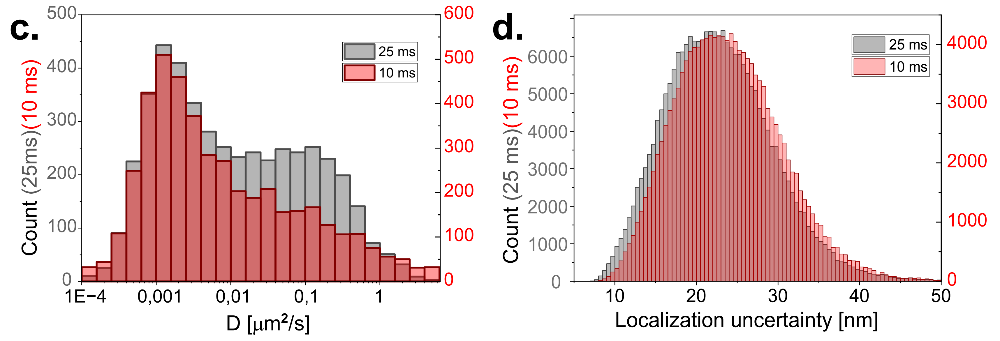

Diffusion coefficient of the tracked quantum dots with 10 and 25 ms
exposure time of the camera. To have similar localization uncertainties,
the laser power was doubled for the shorter exposure time. Two
populations can be identified. The first one has a slower diffusion and
corresponds to particles which are stuck or simply immobile. The other
population which seems to have a maximum around
$D = 0,1\\frac{\\text{µm}^{2}}{s}$ and corresponds to the random
diffusion of GPI on the cell membrane.

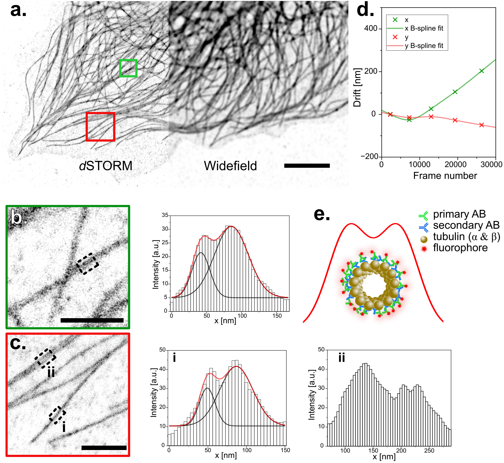

*d*STORM image of microtubules reconstructed from wide-field images
acquired on the UC2. **a.** Immuno-stained microtubules in CV-1 cells
are shown in wide-field and with *d*STORM. Scale bar represents 5 µm.
**b.** and **c.** show the averaged profiles along 200 nm of
microtubules within two regions of interest. Profiles are fitted with a
double Gaussian. Peak to peak distances of (38±2) nm for **b** and
(43±2) nm for **c.i** are extrapolated. Scale bar represents 1 µm in the
magnified ROIs. **d.** Drift measured by cross-correlation during the
raw-data acquisition period of the reconstructed image displayed in
**a**. **e.** Simplified schematic of the front view of a microtubule
sample after immuno-staining and the resulting railroad tracks.

## Imaging with lower-budget objectives

Stable HeLa cell-line with Clathrin light chain-GFP stained with AF647
conjugated anti-GFP nanobodies, in the fluorescence as well as the
brightfield channel. Images have been acquired with the different
objectives listed in the top of the image. The scale bars in the 20 ×,
60 × and 100 × magnified images respectively represent 30 µm.

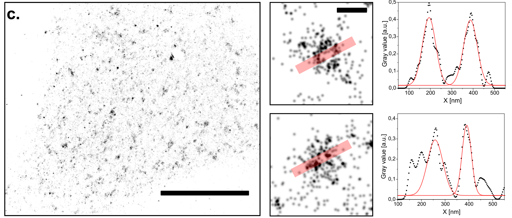

Single molecule localization microscopy (*d*STORM) on the UC2 setup with
a low-budget objective. Reconstruction of CLC-GFP in HeLa cells
immuno-stained with AF647 conjugated nanobodies. Scale bar for
represents 10 µm. Two CCPs have been zoomed in to plot the profiles
along the red transparent line. Scale bar for the magnified regions of
interest represents 200 nm.
