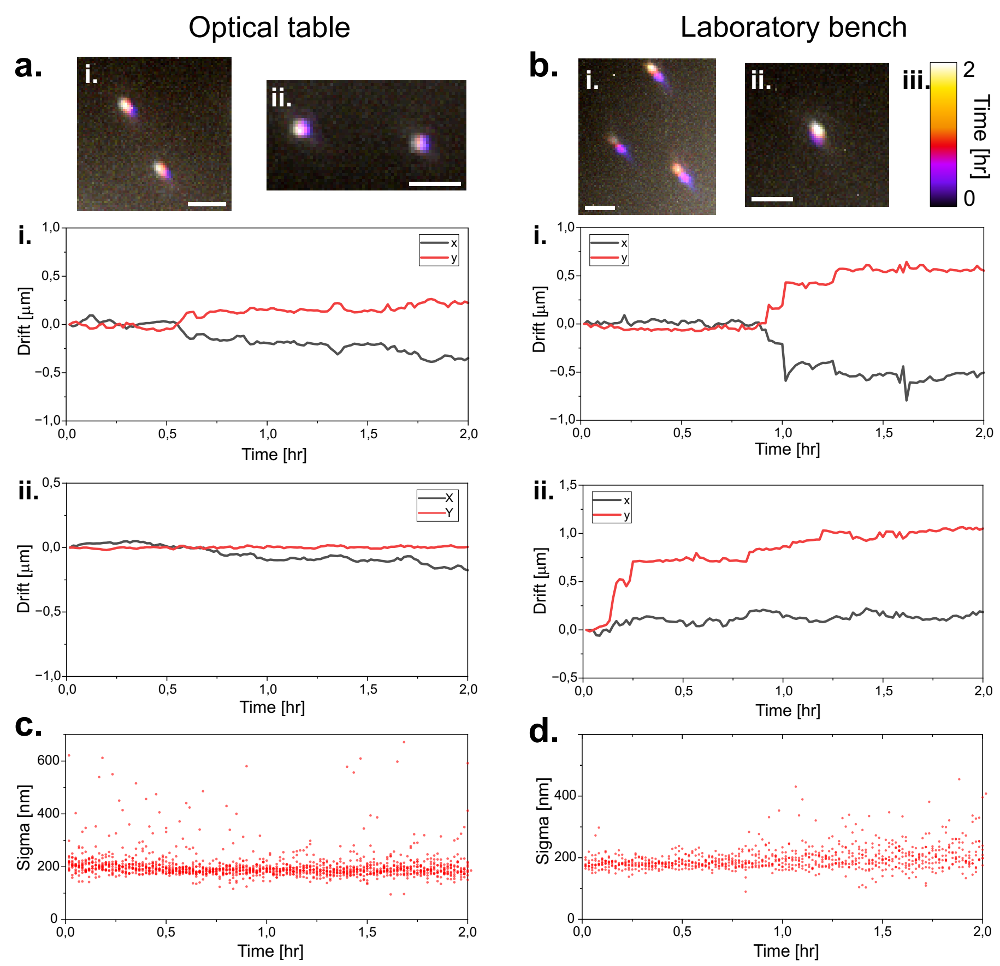

## Setup stability

Measurement of the drift of fluorescent TS beads on the UC2 setup with
60x objective over a duration of two hours positioned upon **a.** an
optical table **b.** a common laboratory bench. Bead positions are
estimated through localization and displacement in **i.** and **ii.**
are plotted in the graphs below. **c.** (for the optical table **i.**)
and **d.** (for the laboratory bench **i.**) show the variation in the
sigma value of the localized beads over the measurement duration. The
sigma value correlates with the defocusing of the beads i.e. low changes
in sigma suggest small fluctuations of the samples axial position.
