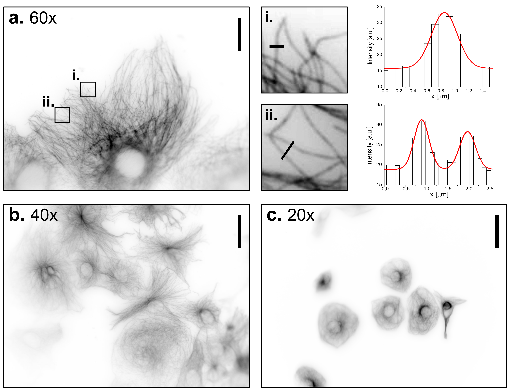
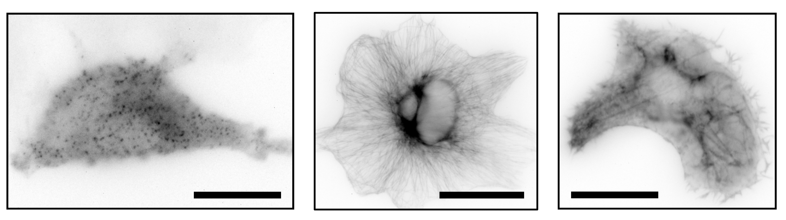
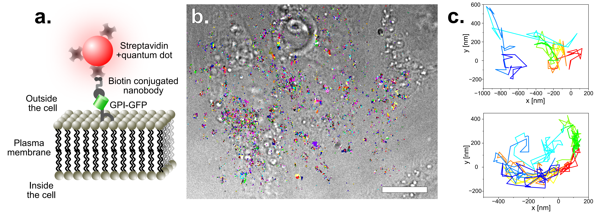
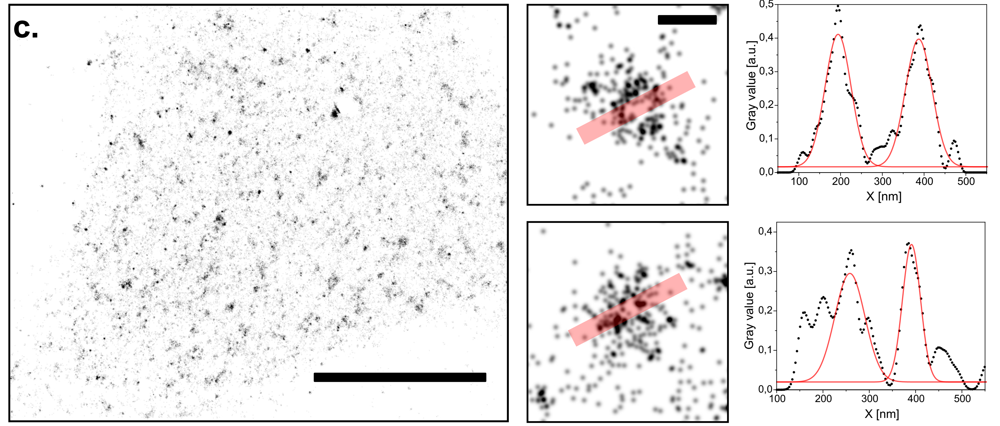

## Imaging with the UC2-STORM setup

Widefield images of CV-1 cells immune-stained against tubulin, at
different magnifications using the UC2 microscope. **a.** 60x objective,
scale bar represents 30 µm. Two regions of interest have been zoomed in
to demonstrate the ability to detect and characterize single
microtubules. **b.** 40x objective, scale bar represents 45 µm. **c.**
20x objective, scale bar represents 90 µm.

Widefield images of immune-stained clathrin coated pits (left),
immune-stained tubulin (middle) and SiR Actin stain of CV-1 cells with
the UC2 setup and a 60x objective. Scale bar represents 25 µm.

Live cell imaging of CV-1 cells stained with SiR actin over a period of
five hours.

Live cell imaging of T98G cells stained with SYTO far red nucleic dye
over a period of two days within an incubator.

Single particle tracking of GPI-GFP on HeLa cells. For more
photostability, the tracks are acquired by imaging quantum dots. These
have been functionalized with straptavidin and are attached to GFP via
biotin conjugated anti-GFP nanobodies. The construct is schematically
disaplayed in **a.** The acquired tracks are overlayed on a bright-field
image of the HeLa cells (**b.**) (scale bar represents 10 µm). Two
single tracks are exeplarily displayed in **c.**

Diffusion coefficient of the tracked quantum dots with 10 and 25 ms
exposure time of the camera. To have similar localization uncertainties,
the laser power was doubled for the shorter exposure time. Two
populations can be identified. The first one has a slower diffusion and
corresponds to particles which are stuck or simply immobile. The other
population which seems to have a maximum around
$D = 0,1\\frac{\\text{µm}^{2}}{s}$ and corresponds to the random
diffusion of GPI on the cell membrane.

*d*STORM image of microtubules reconstructed from wide-field images
acquired on the UC2. **a.** Immuno-stained microtubules in CV-1 cells
are shown in wide-field and with *d*STORM. Scale bar represents 5 µm.
**b.** and **c.** show the averaged profiles along 200 nm of
microtubules within two regions of interest. Profiles are fitted with a
double Gaussian. Peak to peak distances of (38±2) nm for **b** and
(43±2) nm for **c.i** are extrapolated. Scale bar represents 1 µm in the
magnified ROIs. **d.** Drift measured by cross-correlation during the
raw-data acquisition period of the reconstructed image displayed in
**a**. **e.** Simplified schematic of the front view of a microtubule
sample after immuno-staining and the resulting railroad tracks.

## Imaging with lower-budget objectives

Stable HeLa cell-line with Clathrin light chain-GFP stained with AF647
conjugated anti-GFP nanobodies, in the fluorescence as well as the
brightfield channel. Images have been acquired with the different
objectives listed in the top of the image. The scale bars in the 20 ×,
60 × and 100 × magnified images respectively represent 30 µm.

Single molecule localization microscopy (*d*STORM) on the UC2 setup with
a low-budget objective. Reconstruction of CLC-GFP in HeLa cells
immuno-stained with AF647 conjugated nanobodies. Scale bar for
represents 10 µm. Two CCPs have been zoomed in to plot the profiles
along the red transparent line. Scale bar for the magnified regions of
interest represents 200 nm.
