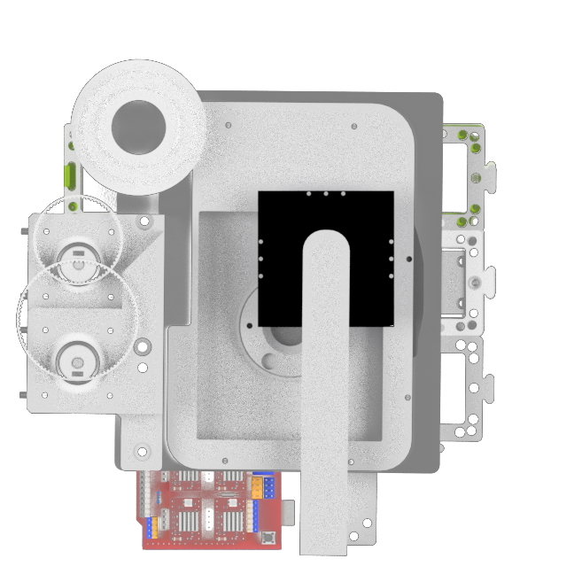
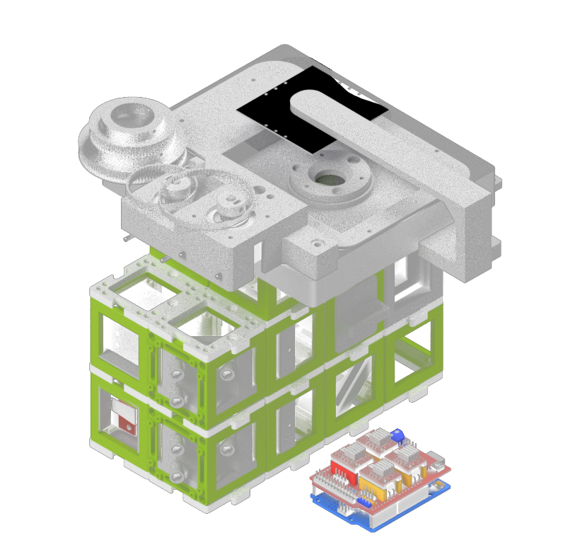

<p align="left">
<a href="#logo" name="logo"></a>
</p>

# U.C.*STORM*
---

This repository will help you to build *a widefield fluorescence microscope and show you how to upgrade it to perform advanced microscopy methods, such as (d)STORM*.


## How does it look like?

### Top View

<p align="center">
<a href="#logo" name="logo"></a>
</p>

### Side View

<p align="center">
<a href="#logo" name="logo"></a>
</p>


***Features:***
* Single-channel fluorescence imaging
* Bright-field imaging
* XYZ motorized automated microscopy
* LED Matrix for quantitative imaging
* Steering fully integrated into ImSwitch


## Assembly

Certainly! The instructions you provided seem like a comprehensive guide to building a single molecule localization microscope using the modular optical system UC2. Below, I've expanded on a few aspects to ensure that the steps are clear and more detailed, providing information about some safety precautions, required materials, and additional tips.

### Microscope Building Instructions

#### 0. Introduction and Precautions

Before we begin, make sure that you are working in a well-ventilated area and wearing appropriate safety gear, such as goggles and gloves. Handling lasers requires caution, so follow the manufacturer's guidelines and take necessary safety measures.

#### Materials and Tools Needed:

- UC2 modular optical system components
- Camera with the compatible mounting system
- Achromatic lens with a suitable mount
- 3D printer (for creating mounts)
- Thorlabs 20mm tube or equivalent
- Laser with adaptable profile
- Convex lenses
- Diffuser (cling foil, etc.)
- Motor-driven translation stage
- 3D printed gears and timing belts
- Commercial XY stage
- 4-well/8-well chambers and circular 18 mm/25 mm cover glass holders
- Alignment tools, such as apertures
- LED for top-light illumination
- Various screws, bolts, and tools for assembly
- Protective gear for handling lasers and other delicate components

#### 1. Detection Layer


The camera is positioned within a cube, so that the camera chip is
centered. At a distance of 100 mm, the tube lens is positioned on the
same optical axis. As a cube is 50 mm broad, an empty cube is placed
between the camera and the lens. A 3D printed mount is combined with a
Thorlabs 20 mm tube, to which a mounted achromatic lens can be screwed
to the tube. The 3D printed mount is thick enough to not tilt while
still being movable. The 3D printed mount holding the lens is moved to
focus an object on the camera. The mirror can be placed in front of the
camera or before the tube lens. The mirror is tiltable along two axes.
The emissions from the objective are parallel. The distance can be
chosen accordingly to the build. A mirror tilted by 45 degrees reflects
the vertical emissions of the sample into the tube lens and subsequently
onto the camera.


Emissions from the objective are reflected by the mirror, focused by the
tube lens, displaced with the tiltable mirror and imaged on the
detector.

#### 2. Laser


The laser profile can be tuned to match the application the microscope
will be used for. When imaging a Chroma red fluorescent slide, the laser
profile can be characterized. Without any modification, the laser only
illuminates a subset of the field of view. By adding a telescope build,
the laser beam is magnified. The telescope is built by placing two
convex lenses in a distance equal to the sum of their focal distances in
the light path. The magnification can then be calculated by the ratio of
the focal lengths (e.g. f1 = 3\*f2 magn. = 3x). If the beam is not
homogeneous or does not have a smooth profile or patterns that vary over
time, the beam can be homogenized through diffusing the light in the
common focal point of both telescope lenses. The diffuser can be as
simple as a cling foil, attached to a rotor or a fan motor and spinning
the foil.


Here, the lens l1 is focusing onto the rotating cling foil. The diffused beam is magnified by the lens l2. The
resulting beam profiles can be seen in following images:

The laser beam without magnification (left) has a smaller spot with high
laser intensity. The illumination is not homogeneous but can be
advantageous for applications needing higher laser densities. The laser
profile with a 2 times magnification (middle) and the magnification with
diffuser (right) enable homogeneous illumination of most of the field of
view.

##### Tips:

- Ensure that the diffuser is balanced properly to avoid vibrations that might affect the image quality.
- Calibration of the laser profile according to the application is crucial. Make sure to test different magnifications and diffusions.

#### 3. Excitation Layer

The laser emission can be chosen accordingly. The laser beam is then
focused by a lens into the back focal plane of the objective (here after
the filter cube in a higher vertical plane). Through a tiltable mirror,
the beam can be positioned into the center of the field of view. The
filter cube has filters adapted to the laser and the fluorophores used
in the experiments. The mount for the laser, the lens, the mirror as
well as the filter cube can all be 3D printed.


##### Tips:

- Ensure that all 3D printed components fit perfectly with the rest of the parts.
- The choice of filters must correspond with the laser and the fluorophores used in the experiments.

#### 4. Z Stage


The z stage is a motor driven translation stage. The
stage is embedded into a 3D printed case to make the dimensions fit the
cube design. A puzzle piece on the top and in the bottom allow to build
a stable connection between the stage and the rest of the microscope. A
3D printed objective holder connects the stage to the objective. It is
advised to print the objective holder with a high percentage of infill
and a stable plastic, as the heavy objective causes strain on the
material.

##### Tips:

- Careful selection of the material for the objective holder is crucial to withstand the weight and strain.

#### 5. XY Stage

The XY stage used in the current build is a commercial solution. The
manual translation knobs were equipped with 3D printed gears. In order
to motorize the stage, motors which were also equipped with gears
transmitted the torque to the stage via timing belts. These were printed
with a softer and thus more elastic plastic. The whole stage is attached
to the rest of the microscope via a 3D printed plate, working as a
replacement for a puzzle layer, with the according perforations where
connections to the top layer of cubes was provided. Furthermore, the
stage needs a 3D printed insert, to hold the sample. Models for
4-well/8-well chambers and circular 18 mm/25 mm cover glass holders are
available. An alternative where the coverglass is directly embedded into
the 3D printed sample holder is also provided.


##### Tips:

- Calibration and testing of the XY stage should be done to ensure smooth and accurate movement.

#### 6. Alignment Procedure

To align the optics, the first step is to position all optics along the
optical axis and ensure that they are not tilted. To make this procedure
more systematic, the excitation pathway is aligned with an aperture,
which is placed between the second lens of the telescope build and the
lens focusing the laser in the back focal plane of the objective. While
imaging a fluorescent slide, an almost closed aperture is placed to
match the maximum of the laser excitation. This allows to know the
position of the laser within the sample. The emission pathway is then
adjusted to have the aperture in the center of the field of view. This
way, the maximal laser intensity spot is in the center of the field of
view, which should both theoretically be along the optical axis.

##### Tips:

- Proper alignment is essential for obtaining accurate results. Take your time and follow systematic procedures.
- Specialized alignment tools and techniques might be needed for precise adjustments.

#### 7. Top Light Illumination

The illumination for bright-field imaging needs to be spatially
invariant in relation to the objective. It is important to attach the
top-light illumination to the main body of the microscope instead of the
XY stage. This is achieved by attaching an LED to a 3D printed arm,
connected to the highest puzzle layer, thus decoupled of the possible
motions of the XY-stage.


##### Tips:

- The brightness of the LED should be adjustable to suit various imaging requirements.
- Consider using a diffuser to create more uniform illumination across the sample.

### Conclusion

Building a single molecule localization microscope with the modular optical system UC2 is an exciting and challenging project. This guide provides a step-by-step approach to construct the microscope and align its various components. Always remember to follow safety precautions and consult manufacturer's guidelines or a professional if you are unsure about any step.

Feel free to share your progress and ask questions on GitHub or other platforms, as the scientific community can be of great assistance in such projects.

Happy building!


# Software

For the control and acquisition software, we use ImSwitch. This is an open-source software centered around Napari as a multi-layer viewer and a rich framework for QT-based widgets. We make use of the open-source localization framework "microEye" ()


## Installation

For the installation we advise you to have a look at the ImSwitch repository here https://github.com/kasasxav/ImSwitch/

After setting up ImSwitch, you can enable STORM reconstruction in real time using the MicroEye Plugin by adding the following configuration to the ImSwitch config file that is located in `~/Documents/ImSwitchConfig/config/imcontrol_options.json`

```json
{
    "setupFileName": "example_uc2_storm_alliedvision.json",
    "recording": {
        "outputFolder": "./ImSwitch/ImSwitch/recordings",
        "includeDateInOutputFolder": true
    },
    "watcher": {
        "outputFolder": "/Users/bene/ImSwitchConfig/scripts"
    }
}
```

The setup file with the actual hardware configuration can be placed here:

`~/Documents/ImSwitchConfig/imcontrol_setups/example_uc2_storm_alliedvision.json`

```json
{
  "positioners": {
    "ESP32Stage": {
      "managerName": "ESP32StageManager",
      "managerProperties": {
        "rs232device": "ESP32"
      },
      "axes": [
        "X",
        "Y",
        "Z"
      ],
      "forScanning": true,
      "forPositioning": true
    }
  },
  "rs232devices": {
    "ESP32": {
      "managerName": "ESP32Manager",
      "managerProperties": {
        "host_": "192.168.43.129",
        "serialport_windows": "COM5",
        "serialport": "/dev/cu./dev/cu.SLAB_USBtoUART"
      }
    }
  },
  "lasers": {
    "488 Laser": {
      "analogChannel": null,
      "digitalLine": null,
      "managerName": "ESP32LEDLaserManager",
      "managerProperties": {
        "rs232device": "ESP32",
        "channel_index": 1,
        "filter_change": false,
        "laser_despeckle_period": 10,
        "laser_despeckle_amplitude": 0
      },
      "wavelength": 488,
      "valueRangeMin": 0,
      "valueRangeMax": 1024
    },
    "635 Laser": {
      "analogChannel": null,
      "digitalLine": null,
      "managerName": "ESP32LEDLaserManager",
      "managerProperties": {
        "rs232device": "ESP32",
        "channel_index": 2,
        "filter_change": false,
        "laser_despeckle_period": 10,
        "laser_despeckle_amplitude": 0
      },
      "wavelength": 635,
      "valueRangeMin": 0,
      "valueRangeMax": 1024
    },
    "LED": {
      "analogChannel": null,
      "digitalLine": null,
      "managerName": "ESP32LEDLaserManager",
      "managerProperties": {
        "rs232device": "ESP32",
        "channel_index": "LED",
        "filter_change": false,
        "filter_axis": 3,
        "filter_position": 32000,
        "filter_position_init": -0
      },
      "wavelength": 635,
      "valueRangeMin": 0,
      "valueRangeMax": 255
    }
  },
  "detectors": {
    "WidefieldCamera": {
        "analogChannel": null,
        "digitalLine": null,
        "managerName": "AVManager",
        "managerProperties": {
            "cameraListIndex": 1,
            "mocktype": "STORM",  
            "mockstackpath": "/Users/bene/Downloads/New_SMLM_datasets/ROI_cos7MT_AF647fluopaint.tif",            
            "avcam": {
                "exposure": 0,
                "gain": 0,
                "blacklevel": 100,
                "image_width": 1000,
                "image_height": 1000,
                "pixel_format": "Mono12"
            }
        },
        "forAcquisition": true,
        "forFocusLock": false
    }
},
"rois": {
    "Full chip": {
      "x": 600,
      "y": 600,
      "w": 1200,
      "h": 1200
    }
  },
  "LEDMatrixs": {
    "ESP32 LEDMatrix": {
      "analogChannel": null,
      "digitalLine": null,
      "managerName": "ESP32LEDMatrixManager",
      "managerProperties": {
        "rs232device": "ESP32",
        "Nx": 4,
        "Ny": 4
      },
      "wavelength": 488,
      "valueRangeMin": 0,
      "valueRangeMax": 32768
    }
  },
  "autofocus": {
    "camera": "WidefieldCamera",
    "positioner": "ESP32Stage",
    "updateFreq": 10,
    "frameCropx": 780,
    "frameCropy": 400,
    "frameCropw": 500,
    "frameCroph": 100
  },
  "availableWidgets": [
    "Settings",
    "View",
    "Recording",
    "Image",
    "Laser",
    "Positioner",
    "Autofocus",
    "STORMRecon"
  ]
}
```

## ImSwitch in Action

Here you can find a tour on Youtube how to set up everything and what it can do.

<p align="center">
<a href="https://www.youtube.com/watch?v=r8f-wmeq5i0" name="logo"></a>
</p>


## Bill of material

Below you will find all components necessary to build this device

### 3D printing files

All these files need to be printed. We used a Prusa i3 MK3S using PLA Prusament (Galaxy Black) at layer height 0.15 mm and infill varying between 20-40 %, depending on how much weight rests on the 3D printed part. For applications within the incubator, the use of ABS Prusament is recommended, as the thermal stability is noticeably increasing the setups stability, especially with increased working temperature and humidity. The layer height and the infill can be chosen identically for ABS as for PLA parts.

An in-depth tutorial on how to build the XY-stage can be found here https://github.com/openUC2/

An in-depth tutorial on how to build the Z-stage can be found here https://github.com/openUC2/


| Printed  | UC2             | Linear Stage mount                                                                                                             | 00_Linear_Stage_NEMA11_Mount.ipt                               | 1  | $5.00   | 5   |
|----------|-----------------|--------------------------------------------------------------------------------------------------------------------------------|----------------------------------------------------------------|----|---------|-----|
| Printed  | UC2             | Linear Stage spacer                                                                                                            | 00_Linear_Stage_NEMA11_Mount_Lid.ipt                           | 1  | $1.00   | 1   |
| IM       | openUC2         | UC2 Puzzle piece                                                                                                               | 10_Base_puzzle_v3.ipt                                          | 26 | $5.00   | 130 |
| Printed  | UC2             | UC2 objective Mount linear stage                                                                                               | 20_Cube_Insert_Cube_Z-Stage_NEMA11_china_objectivemount_v3.ipt | 1  | $1.00   | 1   |
| IM       | openUC2         | openUC2 IM Cube                                                                                                                | 10_Cube_1x1_IM.ipt                                             | 42 | $5.00   | 210 |
| External |                 | 5 mm Neodym Magnets                                                                                                            | 00_BallMagnets_5mm_single.ipt                                  | 9  |         | 0   |
| Printed  | UC2             | UC2 Insert for Kinematic Mirror Part1                                                                                          | 20_Cube_Insert_Kinematic_Mirrormount_45_base_part1.ipt         | 3  | $5.00   | 15  |
| Printed  | UC2             | UC2 Insert for Kinematic Mirror Part2                                                                                          | 20_Cube_Insert_Kinematic_Mirrormount_45_base_part2.ipt         | 3  | $1.00   | 3   |
| Printed  | UC2             | Adapter for Nut                                                                                                                | 30_Adapter_M3_nut.ipt                                          | 9  | $1.00   | 9   |
| External | Würth           | DIN 912 - M3 x 0.5 x 12 x 10.75.ipt                                                                                            | DIN 912 - M3 x 0.5 x 12 x 10.75.ipt                            | 15 | $1.00   | 15  |
| Printed  | UC2             | UC2 Insert for 1 inch Mirror, 45°                                                                                              | 20_Cube_Insert_Kinematic_Mirrormount_45_Thorlabsadapter.ipt    | 3  | $5.00   | 15  |
| External | Thorlabs        | Thorlabs PF 10-03-P01                                                                                                          | 00_Thorlabs_PF10-03-P01-Step.ipt                               | 3  | $25.00  | 75  |
| External |                 | Allied Vision Alvium USB 3.1 Kamera 1800 U-158m, 1/2,9", 1,58 MP, C-Mount, monochrom                                           | *Varies*                                                       | 2  | $445.00 | 890 |
| External |                 | C:\cad\PSP2011Client\Work\139705407318IP01941702.stp                                                                           | 00_Basler_ace_USB3_C-Mount.ipt                                 | 1  |         | 0   |
|          | UC2             |                                                                                                                                | 20_Cube_Insert_Cmount_v3.ipt                                   | 1  | $5.00   | 5   |
| External | Thorlabs        | Thorlabs CP33                                                                                                                  | 00_Thorlabs_Cage_CP33_M.ipt                                    | 2  | $20.00  | 40  |
| Printed  | UC2             | UC2 Insert for Thorlabs Cage                                                                                                   | 20_Cube_Insert_Thorlabs_Pins.ipt                               | 2  | $5.00   | 10  |
| Printed  | UC2             | UC2 Insert for Thorlabs 1inch lens                                                                                             | 20_Cube_Insert_Thorlabs_SM1Tube.ipt                            | 2  | $5.00   | 10  |
|          | Thorlabs        | Thorlabs AC254-050-A-ML                                                                                                        | 00_THORLABS_AC254-050-A-ML-Step.ipt                            | 2  | $100.00 | 200 |
| Printed  | UC2             | Filtermount                                                                                                                    | 30_Cube_Insert_Filter_Revolver_Filter_base_single_v3.ipt       | 1  | $5.00   | 5   |
| External | Euromex         | Euromex Mechanischer 180 x 155 mm Objekttisch mit integriertem 75 x 55 mm X-Y-Kreuztisch und transparenter Glasplatte, NZ.9505 | 00_XYTable_china_75_55mm.ipt                                   | 1  | $200.00 | 200 |
| Printed  |                 | Uc2 Insert for Allied Vision Camera                                                                                            | 30_XYTabel_Aliexpress_basplateadapter.ipt                      | 1  | $7.00   | 7   |
| Printed  |                 | Motormount for XY stge                                                                                                         | 30_XYTable_Aliexpress_motormount.ipt                           | 1  | $7.00   | 7   |
| Printed  |                 | Sample Inset for XY Stage                                                                                                      | 30_XYTable_Aliexpress_sampleinsert_round.ipt                   | 1  | $7.00   | 7   |
| External | Roboter Bausatz | GT2 Riemenscheibe 16 Zähne 4mm Bohrung für 6mm Zahnriemen                                                                      | 00_XYTable_pulley.ipt                                          | 2  | $2.00   | 4   |
| Printed  | UC2             | Timing Gear Small                                                                                                              | 00_XYTable_medium_gear.ipt                                     | 1  | $2.00   | 2   |
|          | UC2             | Timing Gear Large                                                                                                              | 00_XYTable_large_gear.ipt                                      | 1  | $2.00   | 2   |
| Printed  | UC2             | Printed Timing Belt Long                                                                                                       | 00_GT2_TimingBelt_flexible_Modular_xytable_large_89tooth.ipt   | 1  | $5.00   | 5   |
| Printed  | UC2             | Printed Timing Belt Short                                                                                                      | 00_GT2_TimingBelt_flexible_Modular_xytable_large_65tooth.ipt   | 1  | $5.00   | 5   |
| External | Laserlands.net  | 638nm Red Laser Module 500mW Round Dot Focusable TTL 3050                                                                      | 00_LASER_640nm.ipt                                             | 1  | $40.00  | 40  |
| Printed  | UC2             | holder for LED Array                                                                                                           | 40_Cube_XY_Table_Illumination_Arm.ipt                          | 1  | $5.00   | 5   |
| External | Adafruit        | Adafruit 64 LED array (8x8)                                                                                                    | 00_LED-ARRAY.ipt                                               | 1  | $20.00  | 20  |
| External | Chroma          | Chroma ET655                                                                                                                   | 00_Chroma_ET655lp long-pass.ipt                                | 1  | $250.00 | 250 |
| External | Chroma          | Chroma ZET 636                                                                                                                 | 00_Chroma ZET635_Excitationfilter.ipt                          | 1  | $250.00 | 250 |
| External | Chroma          | Chroma ZT640                                                                                                                   | 00_Chroma_ZT640rdc.ipt                                         | 1  | $250.00 | 250 |
| External | -               | Linear Stage 50mm , Nema 12, MGN9h                                                                                             |                                                                | 1  | 50      | 50  |

### Design files

The original design files are in the [INVENTOR](./INVENTOR) folder.

### Electronics

Here we make use of the ESP32 Wemos D1 R32 microcontroller board in combination with the CNC Shield v3. The wiring of the different components is straight forward as the Stepper Motors are attached to the stepper drivers and the Laser is triggered by the `SpinEn` pin. The NeoPixel LED mounts to the  `Hold` pin.

<p align="center">
<a href="#logo" name="logo"></a>
</p>

#### Flashing the firmware

Go to the website https://youseetoo.github.io/ and choose the CNC board as the hardware configuration to flash the latest version of the Firmware. The PS3 controller's MAC address has to be setup with the PS Pairing tool. The actual MAC Address is printed out on the Serial monitor while the Board is booting up.


## Showcase
The compact size of the setup and the modular character allow to adapt the setup to any incubator. ImSwitch can be started from any given compute ror laptop. Simple USB cables connect the microscope to the outside (computer) for full control over its functionalities.
Here you can see the device in action:

<p align="center">
<a href="#logo" name="logo"></a>
</p>gith


<p align="center">
<a href="#logo" name="logo"></a>
</p>

<p align="center">
<a href="#logo" name="logo"></a>
</p>

<p align="center">
<a href="#logo" name="logo"></a>
</p>

<p align="center">
<a href="#logo" name="logo"></a>
</p>

<p align="center">
<a href="#logo" name="logo"></a>
</p>


## Wide-field imaging


## Mechanical stability of the setup

## Live-cell imaging

## Single molecule applications


## Get Involved

This project is open so that anyone can get involved. You don't even have to learn CAD designing or programming. Find ways you can contribute in  [CONTRIBUTING](https://github.com/openUC2/UC2-GIT/blob/master/CONTRIBUTING.md)


## License and Collaboration

This project is open-source and is released under the CERN open hardware license. Our aim is to make the kits commercially available.
We encourage everyone who is using our Toolbox to share their results and ideas, so that the Toolbox keeps improving. It should serve as a easy-to-use and easy-to-access general purpose building block solution for the area of STEAM education. All the design files are generally for free, but we would like to hear from you how is it going.

You're free to fork the project and enhance it. If you have any suggestions to improve it or add any additional functions make a pull-request or file an issue.

Please find the type of licenses [here](https://github.com/openUC2/UC2-GIT/blob/master/License.md)

REMARK: All files have been designed using Autodesk Inventor 2019 (EDUCATION)


## Collaborating
If you find this project useful, please like this repository, follow us on Twitter and cite the webpage! :-)


# Unsorted Images


.jpeg)
.jpeg)
.jpeg)

.jpeg)

